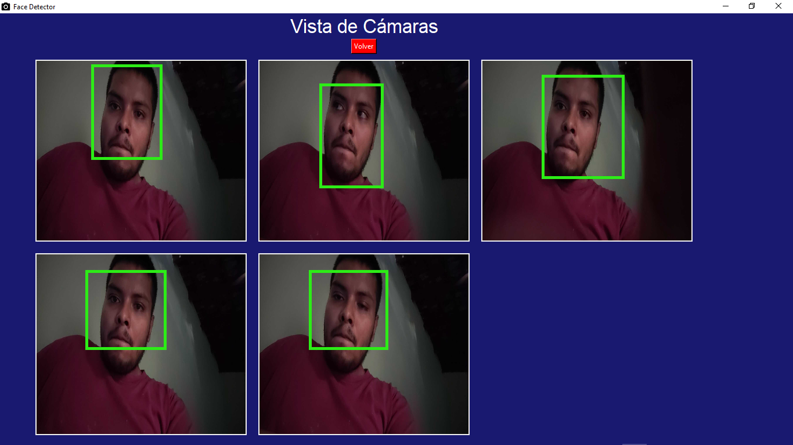

# Real-Time Face Detection GUI

📍 **Category:** Computer Vision and Real-Time Systems

📌 **Technologies used:** **Python (Tkinter), PIL (Pillow), OpenCV**



---

## 📌 Description
A Python-based GUI application for real-time face detection using multiple IP cameras or video streams. The interface is built with Tkinter, and the detection logic is powered by OpenCV. This system is designed for monitoring robotic systems (or similar applications) with flexible camera configurations.

---

## 🖥️ Features

- 🔐 **Login-like interface** for IP camera configuration.
- 📡 **Supports up to 5 simultaneous IP cameras**.
- 🧠 **Real-time face detection** using Haar cascades.
- 🎛️ **Enable/disable face detection** dynamically.
- 🔁 **Switch between views** (Login, Menu, Camera View).
- 🔧 Easily expandable to support local webcam, image and video file analysis.

---

## 🧰 Requirements

Install the dependencies with:

```bash
pip install opencv-python pillow tkinter